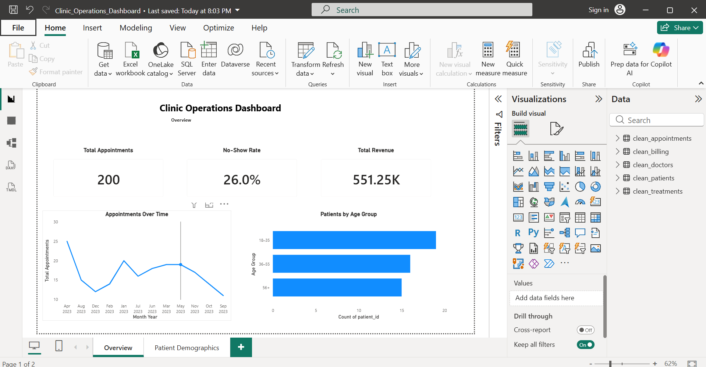
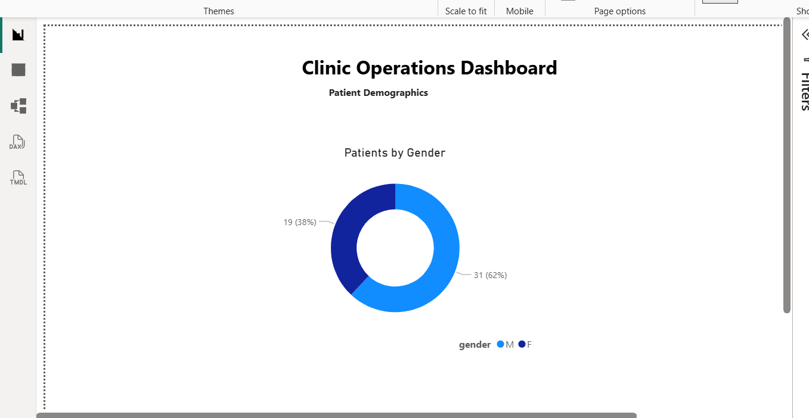

## Clinic Operations Dashboard (Power BI)

### Patient Demographics

This project analyzes clinic appointment, patient, and billing data to support operational decision-making.
## Business Questions Answered

This dashboard was designed to help clinic managers answer the following questions:

- How many appointments are being scheduled, and how is this changing over time?
- What percentage of appointments result in no-shows?
- How much revenue is generated, and how does it relate to treatments?
- What is the age and gender distribution of patients?
- Which patient groups are most common at the clinic?

### Key Insights
- Total appointments and no-show rate tracking
- Revenue overview from billing data
- Appointment trends over time
- Patient demographics by age group and gender

### Tools Used
- Python (data cleaning and preprocessing)
- Power BI (data modeling, DAX measures, visualization)

### Skills Demonstrated
- Data cleaning and preparation
- Power BI relationships and measures
- KPI design and time-series analysis
- Dashboard layout and business storytelling
